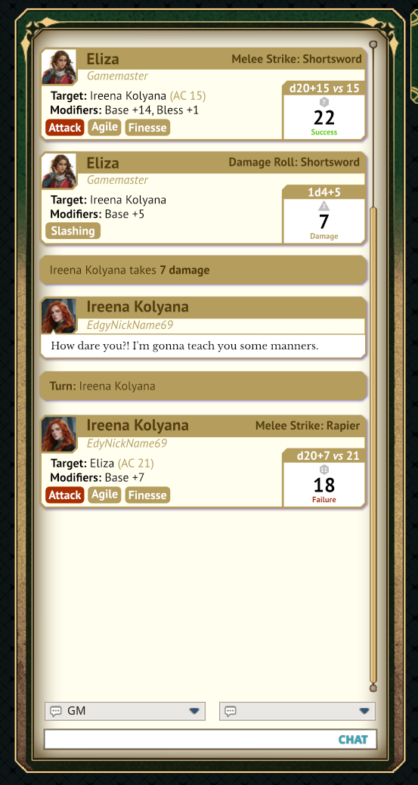

# ChatCards — Design Documentation

Living documentation for how the extension works and the decisions behind it.
Add a dated entry to the decision log whenever we settle something new.

## Goal

Replace Fantasy Grounds Unity's plain chat log with rich, card-style messages
in the spirit of D&D Beyond's roll cards. Target ruleset: **5E**.

## Reference mockup



`mockup-chat-cards.png` (2026-07-28) is the visual north star. It defines:

- **Action cards** (attack / damage): portrait top-left; gold header bar with
  the actor name (left, dark) and the action title "Melee Strike: Shortsword"
  (right, white); italic subtitle line with the controlling user
  ("Gamemaster" / player nickname); body lines `Target: Ireena Kolyana (AC 15)`
  and `Modifiers: Base +14, Bless +1`; keyword chips bottom-left (red for the
  action type — Attack — gold for weapon properties — Agile, Finesse); a
  result box on the right with a gold strip showing the formula
  (`d20+15 vs 15`), the big total (`22`/`7`/`18`), and the outcome label
  (green *Success*, red *Failure*, tan *Damage*).
- **Speech cards**: portrait, gold name bar, italic nickname subtitle, framed
  cream text panel with the spoken line.
- **Banners**: single-line gold bars for system events — `Turn: Ireena
  Kolyana`, `Ireena Kolyana takes 7 damage` (with the number bolded).
- **Palette**: parchment card bodies on the chat frame, gold (#B99C5B-ish)
  bars and banners, cream text panels, red accent chips, white result boxes.
- **Die glyphs**: understated shapes with a white numeral, so the total reads as
  the result — the mockup used #C0C0C0, and they now take the neutral tag
  pill's #D8D2BD so pills and dice read as one family. The art is full white
  and tinted at runtime (`DIE_COLOR` in `chatcard_action.lua`), so recolouring
  needs no re-export.
  On an advantage or disadvantage roll the *kept* die is tinted with the
  positive / negative accent instead, matching its tag pill. Note the die type
  convention: it is a leading letter plus the side count, and
  `ActionD20.decodeAdvantage` **replaces** that letter on the kept die rather
  than prefixing it — `d20` becomes `g20` or `r20`, not `gd20`. Matching on
  `d%d+` therefore finds nothing on a kept die, which showed up as an
  untinted d6 fallback; both the shape and the tint key off the number, with
  the letter choosing only the colour. The accents live in
  `ChatCardsManager.COLOR_POSITIVE` / `COLOR_NEGATIVE`, which the pill art is
  drawn to match — keep the two in step.

## How the extension works

```
                        sending client                     every client
                  ┌──────────────────────────┐      ┌────────────────────────┐
 5E action roll ─►│ ActionAttack.onAttack-   │      │ chatcards_card OOB     │
                  │ Resolve wrap / "damage"  ├─OOB─►│ handler → action card  │
                  │ handler wrap: capture    │      │ in the cards list      │
                  │ structured rRoll data    │      └────────────────────────┘
                  └────────────┬─────────────┘
                               │ original text message (unchanged)
                               ▼
                  hidden engine chatwindow  ◄─── keeps /log, entry box,
                  (1x1, invisible)               other extensions working
                               │
 speech/banners ─► ChatManager receive callback ─► speech card / banner
                   ([ATTACK]/[DAMAGE] text skipped to avoid duplicates)
```

Three layers:

1. **Display** (`desktop/desktop_chatcards.xml`): overrides CoreRPG's `chat`
   windowclass. Our `windowlist name="cards"` replaces the visible log and
   accepts the same dice/number/string drops. Card windowclasses live in
   `common/windowclass_chatcards.xml`; chips and portraits are templates in
   `common/template_chatcards.xml`.
2. **Message classification** (`scripts/manager_chatcards.lua`,
   `ChatCardsManager`): every received chat message becomes a card — dice
   messages → generic roll card, speech modes → speech card, anything else →
   banner. Exposes `addCard`/`sendCardOOB`/`buildDiceFormula` helpers.
3. **Ruleset data capture** (`scripts/chatcards_5e.lua`, `ChatCards5E`):
   wraps 5E resolution functions to grab data that no longer exists once the
   message text is flattened (target AC, hit/miss/crit, net modifier), and
   broadcasts it as an OOB message so all clients render identical cards.

## Card metrics (art reference)

**Width is variable** — the card list is anchored inside the chat window with
2px on the left and 20px on the right (the scrollbar is 20px wide and anchors
to the list's right edge, so that side cannot tighten much further), giving
`card width = chat panel content width − 22`. The card art's own ~5px inset
sits inside that. The chat window's minimum width is 350, so cards run from
roughly 310px up to 700px+ on a wide panel; ~500px is typical at the default
size. Design the horizontal middle to survive that range.

**Heights are deterministic.** A windowclass frame is drawn over the whole
window rect, margins included, so the frame canvas equals the card height
below. No card class carries a margin: separation between rows comes from the
~5px inset in `cc_card`, which every class (including system messages) uses
as its background.

| card | height / frame canvas |
|---|---|
| system message (Turn / takes N damage) | 34px |
| story / narration, one line | 34px |
| plain roll / save / check (modifier line) | 84px |
| damage (target + weapon line, chips, outcome) | 114px |
| attack (target + modifiers, chips, outcome) | 114px |
| speech, one line of text (+19px per extra line) | ~93px |
| damage 4d6 → 2 dice rows | 114px |
| fireball 8d6 → 3 dice rows | 138px |

The left column's body rows start at y=55, just below the 44px avatar
(which ends at y=49) — that avatar bottom is the floor for anything in that
column, since the body lines are left-aligned under it.

Each extra dice row adds 24px (22px glyph + 2px gap, 4 per row). All card
content is inset 5px from the window edge, matching the art's shadow border —
so the usable interior is `height − 10` tall and `width − 10` wide.

**Fixed-size pieces** (design these 1:1, no stretching):
avatar 40x40 at +5+2,+5+2 with 4px rounded corners (no border graphic) · header bar 26px tall,
`card width − 44` wide · tag pills 14px tall, `label + 12px` wide ·
result area 110px wide, spanning the card's full inner height (dice, total and
outcome top-aligned inside it; the roll-type label lives in the left column
under the actor and player names).

**Authoring rule:** stretching softens, compression stays sharp — so author
for the *largest* card you expect and let smaller ones compress. `cc_card` is
currently 256x256 with `10,10,10,10` offsets: its 236x236 centre compresses
vertically at every card size and stretches ~2x horizontally at a typical
490px card, which is fine. Separation between cards comes from the ~5px soft
glow inset on all four sides of that art — replacements need an equivalent
inset (or the classes need a margin plus a transparent gutter again).
`cc_banner` is no longer used — system messages share `cc_card` — but it is
kept generated with the card's geometry (5px inset, 4px radius) in case a
distinct banner style is wanted again. An earlier mismatch there (banner
radius 10 vs card radius 4) showed up as a stepped silhouette wherever a
banner met a card.

### 2026-07-29 — System and story cards are separate classes
Both are the same full-width text layout, but system messages use
`cc_system_card` (same geometry as `cc_card` — 5px inset, ~4px radius — with a
darker fill) and story text keeps `cc_card` with the italic `cc_story` font. A
windowclass `<frame>` is static XML and windows have no per-instance frame
setter, so this is two classes (`chatcard_system`, `chatcard_story`) rather
than one with overrides. The cards windowlist declares `chatcard_system` as
its default class.

### 2026-07-29 — Speech bubble art (cc_speak_area)
Spoken text uses `cc_speak_area.png`: a white bubble whose tail occupies the
top 6 rows at x=6..14. Two consequences for the 9-slice — the **left** slice
must be at least 15 so the tail sits wholly inside it (otherwise the stretched
centre smears it), and the **top** slice must cover the tail plus the body's
corner; hence `16,10,8,8`. The control's frame offset (`8,12,8,6`) extends the
bubble 12px above the text, 6 of which are the tail, so the text keeps its
padding below it. The control anchors to the avatar's bottom rather than the
name block, so the tail always lands just under the avatar it points at.
Replacements need the tail in the same place, or those offsets change.

The bubble's left, right and bottom edges sit exactly on the card art's body
edges — the frame reaches 8px sideways and 6px below its control and the card
art is inset 5px, so the control spans 13..width-13 with an 11px bottom
spacer. At those three edges the bubble's own border *is* the card's border.

### 2026-07-29 — Tags are registered by the ruleset, not the manager
Which pills a card shows is a per-system concern, so `ChatCardsManager` only
provides the mechanism: `registerTagProvider(sCardType, fn)` collects
providers per card type, `buildTags(sCardType, tContext)` runs them in
registration order at card-build time (on the rolling client, where the roll
data still exists), and the result travels in the payload as one encoded
string — `"Attack:red;Advantage:green;Finesse"`, where the suffix names a
pill style and no suffix means neutral. Styles (`red`, `green`, `neutral`)
are defined once in the `cc_chip` template, which also sets the label colour
per style, since the neutral art is light while red and green are dark.
Nothing in the manager or the card window knows any tag name; adding a
system, or a plugin extension adding tags to an existing one, means
registering another provider.

The same encoding carries the **modifier row**: the ruleset sends
`sMods` as styled segments (`"Crossbow, Light +3;Bless +1d4:positive"`) and the
card joins them with a middot, colouring only each segment's *value* — the
trailing signed number or dice expression — with the positive/negative accent.
The first segment deliberately carries no style, because it is the roll's own
bonus rather than a modifier on top of it, so its value stays plain. The value
pattern requires a digit or `d` after the sign, so a hyphenated name with no
bonus ("Two-Handed") is left alone instead of splitting.

The base bonus in that row is derived **by subtraction**: whatever remains of
`rRoll.nMod` once the itemized effect modifiers are taken out, so the segments
always add up to the total the dice were rolled with. `rRoll.nEffectMod` looks
like the obvious source for the effect share, but it does not hold the effect
total by the time a roll resolves — trusting it made the base too low and left
the difference showing as a phantom "Other effects" entry (an `ATK: -1` effect
on a +4 weapon read "+3 · Weak -1 · Other effects +1", both wrong). The
trade-off of subtraction is that an effect which cannot be attributed to a
named `ATK`/`@ATK` effect — exhaustion, ability-score effects — is absorbed
into the base rather than listed separately.

### 2026-07-29 — Saves and checks get the attack card's treatment
Saves, ability checks and skill checks now have dedicated hooks rather than
falling through to the generic roll card, so they show the same things an attack
does: an itemized modifier row, and a `DC: 15` line rendered with the same bold
label as `Target:` when the roll has a target DC (`rRoll.nTarget`), plus a
Success / Failure outcome measured against it. The ability or skill names the
base modifier, the way a weapon does on an attack card, so the title is just
"Saving Throw" / "Ability Check" / "Skill Check".

Hook points: `ActionSave.onSaveResolve` wraps like the attack's resolve hook,
while checks and skills share `ActionCheck.onRoll`, so both of its result
handlers are re-registered (as with damage). Effect queries per type: `SAVE`
for saves, `CHECK` for ability checks, and `CHECK` + `SKILL` for skills — what
the ruleset itself queries.

One catch: the ruleset's effect filters (`tSaveFilter`, `tCheckFilter`,
`tSkillFilter`) are **tables**, and only scalars survive the dice throw's
encode/decode, so they are nil by resolve time. They are rebuilt from the
string fields that do survive — `sSave`, `sAbility`, `sSkill` — which matters
because without a filter a conditional effect (a bonus to *dexterity* saves)
would be counted on every save. One shared `buildRollModBreakdown` now serves
attacks, saves and checks; each type only supplies its queries.

`ChatCards5E` registers providers for `attack`, `damage` and `roll`: the
action-type tag (red), `Advantage` (green) / `Disadvantage` (red) — detected
from the roll flags, falling back to the `g`/`r` die-type prefix
`ActionD20.decodeAdvantage` leaves on the kept die, with both flags together
cancelling as in the rules — `Critical!`, the damage type, and the weapon's
properties —
those come from the weapon entry on the source's sheet matched by the roll's
label, since the roll carries no weapon node, with range parentheses
("Thrown (20/60)") dropped. Card type `roll` also builds tags, so saves and
checks can be tagged without touching the card layer.

Cards have six pill slots, filled in order on one row; providers should
return their most important tags first, since anything past the last slot is
dropped. Wrapping to a second row would need the pills' widths measured and
positioned from Lua, as the dice glyphs are.

## Decision log

### 2026-07-28 — Replace the chat display, don't restyle it
FGU's `chatwindow` control is compiled into the client; per-message layout
(portrait placement, single font per message, no sub-frames) is not moddable.
The mockup is impossible inside it. **Decision:** hide the engine control at
1×1 (it must exist — the chat entry targets it — and feeding it preserves
`/log` export and third-party extension compatibility) and render our own
windowlist. Cost we accept: we re-implement scrollback trimming, autoscroll,
and drop handling ourselves.

### 2026-07-28 — Capture structured data at action resolution, not from text
Parsing `[ATTACK (M)] Shortsword [HIT]` strings would break with localization
and ruleset updates, and the modifier breakdown/AC aren't in the text anyway.
**Decision:** hook `ActionAttack.onAttackResolve(rSource, rTarget, rRoll,
rMessage)` (called through the `ActionAttack` table, so table-replacement
works) and re-register the `"damage"` result handler around
`ActionDamageD20.onRoll` (CoreRPG captured the original reference at init, so
re-registration is required, not table replacement). `rRoll` carries `nTotal`,
`nDefenseVal`, `sResult`, `nMod`, `aDice`.

### 2026-07-28 — Broadcast cards as OOB messages
Custom fields on chat messages don't survive network delivery, and resolution
runs only on the rolling client. **Decision:** card payloads travel as a
`chatcards_card` OOB message (`Comm.deliverOOBMessage`) delivered to every
client, GM included. All OOB values are stringified in transit — card scripts
treat every field as a string. The original flattened text message still goes
to the hidden chat log; the receive callback skips `[ATTACK`/`[DAMAGE` texts
so cards aren't duplicated.

### 2026-07-28 — One `chatcard_action` class for attack/damage/roll
Attack, damage, and generic rolls share ~90% of their layout (header, body
lines, chips, result box). **Decision:** one windowclass configured by
`setData` (`sCardType` picks chip/outcome styling) instead of three near-copies.

### 2026-07-28 — Placeholder art, real fonts
All frames are generated flat-color 9-slice PNGs (regenerate with
`Design/gen_frames.py`) matching the mockup palette, so the
whole look can be replaced by swapping PNGs without code changes. Fonts are
Noto Sans TTFs copied from the user's CoreRPG (SIL OFL), with card-specific
sizes/colors defined in `graphics/graphics_chatcards.xml`.

### 2026-07-28 — Secret rolls produce no card
Dice-tower and GM-hidden rolls would leak information if broadcast.
**Decision:** `bSecret`/`secret` rolls are skipped entirely on the card layer;
they still behave normally in the hidden engine log.

### 2026-07-28 — Generic roll cards hook resolveAction; receive is text-only
In-app testing showed that `onReceiveMessage` delivers roll messages with
`msg.dice` empty — dice data is not usable on the receive side, so cards for
rolls can't be built there. All roll types (including basic desktop dice —
`"dice"` is a registered action in `GameSystem.actions`) resolve through
`ActionsManager.resolveAction` on the rolling client, so ChatCards wraps it
once and broadcasts a generic roll card OOB for every type without a
dedicated hook. The receive callback is left with text-only classification:
a skip-list of uppercase roll tags (`[ATTACK`, `[SAVE`, ...) suppresses the
flattened roll texts, mixed-case apply texts (`[Attack ...]`) are dropped or
converted to banners, and everything else becomes speech/banner cards.

### 2026-07-29 — Tag pills: 9-slice per style, art at the drawn height
Pills are 9-slice framedefs, one per style: `cc_tag_neutral`,
`cc_tag_positive`, `cc_tag_negative`, each 28x14 with offsets `7,6,7,6`.
Styles are named for **meaning rather than colour**, so a ruleset asks for
`positive` and the art decides how that reads; the `cc_chip` template maps the
name to a frame and a label colour (the neutral art is light, so its label is
dark).

**Pill art must be at the height the pill is drawn (14px).** A frame's border
bands are never scaled, so 32px-tall art renders a 32px-tall pill, and no
offset combination shrinks the caps into a 14px row without cutting the curve
and smearing it through the stretched middle. `Design/fit_pill_art.py`
converts an export of any size down to the drawn height and re-solidifies it
(the downscale re-mixes colour into the transparent pixels, so solidifying has
to come after).

A tinted-widget build was tried first — one white shape recoloured in FG, which
would have given resolution independence *and* one asset for every style — and
abandoned. Widgets draw in creation order with no way to reorder
(`bringToFront` is a window API), a bitmap widget's draw size only takes effect
at creation (`setSize` afterwards left every piece at cap width), and the
result never rendered correctly. Worth knowing the two capabilities exist —
`setColor` tints widgets and control icons, and CoreRPG uses it — but for a
variable-width pill the 9-slice is the tool that works.

### 2026-07-29 — Transparent pixels must carry colour, not black
FG filters textures as it draws them, so a soft edge pixel is averaged with
its transparent neighbours' *colour* as well as their alpha. Image editors
leave transparent pixels black, which ringed light art with a dark halo —
clearly visible around the neutral tag pill, whose fill is barely darker than
the card. Every asset had it; it simply did not show on dark art like the die
glyphs.

`Design/solidify_alpha.py` bleeds the nearest visible colour outwards into the
transparent pixels and leaves every alpha untouched, so appearance is
unchanged but there is no black left to average in. It is idempotent, runs
over all frames and icons by default, and `gen_frames.py` calls it on its own
output. **Run it after re-exporting art from an image editor**, or the fringe
comes back with the export.

### 2026-07-29 — Layout spacers must not be `<invisible />`
A control marked `<invisible />` stops taking part in the anchor layout, so
sizing it from Lua moves nothing — which is why two attempts at vertically
centring the result contents appeared to do nothing at all. Spacers must be
plain `genericcontrol`s with no frame or icon (they then draw nothing but
still occupy space), exactly like the `sizer` controls that set each card's
height. `<invisible />` is only for controls whose visibility is genuinely
toggled, such as the token avatar layer.

### 2026-07-28 — Card backgrounds are windowclass frames
Full-window `bg` generic controls anchored to all four edges collapse to zero
height inside list windows (the window's height derives from its content, so
the bottom anchor resolves before the height exists). List-entry windowclasses
support a top-level `<frame>` instead — same pattern CoreRPG's combat tracker
entries use (`<frame>ctentrybox</frame>`) — so each card class declares its
background frame there.

### 2026-07-29 — cc_card separation moved from gutter to art glow
The 256x256 card art (10px 9-slice) carries a soft ~5px glow inset on every
side, which separates neighbouring cards on its own. The action and speech
classes therefore dropped their `0,0,0,8` bottom margin — with the frame
stretching over margins, that margin only added internal padding once the
gutter was gone. The banner still uses the gutter approach.

### 2026-07-28 — Inter-card spacing lives in the frame art
FG has no list row-spacing property, and windowclass frames stretch over the
window's margin area, so margins alone produce touching borders. The 8px gap
is baked into `cc_card.png` / `cc_banner.png` as a fully transparent bottom
band kept inside the bottom 9-slice slice (framedef offsets `12,12,12,20`
and `12,10,12,18`). Replacement art must keep this gutter (or the offsets
must be adjusted).

### 2026-07-28 — Portrait pipeline: three layers + custom portrait set
The avatar area is three stacked controls: token layer (NPC `picture` /
`token` art), icon layer (PC portraits, GM badge, "?"), and a border-only
frame drawn on top. Avatar layers are 38x38 at +3,+3 — the inner area of the
44x44 frame — so art never pokes past the border (token controls cannot be
masked; an opaque-cornered masking frame was tried and rejected on looks).
PC portraits come from our own `ccard` portraitset (transparent base,
full-size rounded mask): CoreRPG's `chat`/`charlist` sets bake a dark ring
and inset into their generated icons, so those are rerouted to `ccard`.

### 2026-07-28 — Unified gold #B49D5D
Header bars, banners, card borders, avatar border, result box, and gold
chips all use #B49D5D (from the mockup), defined once as `GOLD` in
`Design/gen_frames.py`.

### 2026-07-29 — Speech cards: speaker from the identity list, portrait from the actor
Chat messages carry no username, and record ownership alone is not enough (a
player given control of a combatant is granted it on the CT entry, not the
creature record, and `ActorManager.getOwner` reads the creature node). The
player label is therefore resolved from the engine identity list — match
`msg.sender` against `User.getIdentityLabel`, then `User.getIdentityOwner` —
the same mapping `ChatManager.searchForIdentity` uses; CT then record
ownership are fallbacks, and "Gamemaster" is the last resort.

The portrait is likewise resolved through `getActorPortrait` so speech cards
follow the roll cards' priority (picture → token → "?") rather than the
engine chat asset's token-first order. `msg.sActorNode` does not survive
network delivery either (same as `msg.dice`), so the receive side finds the
actor by matching the sender label against the combat tracker, then the NPC
and character records.

### 2026-07-29 — OOB targeting: secret to the GM, everything else broadcast
`Comm.deliverOOBMessage(msg, "")` targets the host only — `""` is the GM, the
same convention `Comm.deliverChatMessage` uses. Card payloads were being sent
that way, so **players saw no roll cards at all** (only speech cards and
system messages, which come from the chat receive path); on a player's own
roll, not even they saw it. Cards are now sent with no target, which reaches
every client including the sender.

Separately, hidden-actor rolls produced no card for anyone: the engine sets
`rRoll.bSecret` when the host rolls for a CT-hidden actor
(`ActionsManager.performAction`), and the hooks were skipping those outright.
They now build the card and route it to the GM only, matching how the engine
delivers the corresponding chat message. `ChatCardsManager.isRollSecret`
also covers the GM's "reveal rolls off" option, mirroring
`ActionsManager.createActionMessage`.

### 2026-07-29 — Avatar corner rounding (4px) needs three mechanisms
FG offers no single way to round the avatar, because each layer renders
differently: PC portraits are engine-composited, so the `ccard` portraitset
mask carries the 4px radius; the GM/"?" badges are our own art, so they are
generated rounded; and NPC token art goes through a `tokencontrol`, which
cannot be masked at all. For that last case a `cc_portrait_cover` icon —
opaque in the frame colour outside a 4px-radius window — is drawn on top of
the avatar (as a widget on the frame control, which is declared after both
avatar layers) so the square corners are covered. It is drawn for every
portrait type so all three look identical. The avatar's border graphic was
then dropped, so the cover is filled with the card art's colour
(`CARD_FILL`, #F0E8D3) to blend the corners into the card — re-sample that
constant if the card background art changes.

### 2026-07-29 — Asset resolution: what sharpening is possible where
FG has no @2x/DPI mechanism (no scale attribute exists on `framedef` or
`icon` in CoreRPG, 5E or CoreRPG_2025), so sharpness depends on how each
asset is drawn:

- **Bitmap widgets** (`addBitmapWidget` with explicit `w`/`h`) — the render
  size is ours, so the source can be authored at 3x and is downsampled once
  at render time. Used for the die glyphs (66px source → 22px) and avatar
  icons (120px → 40px). Real win, no extra on-screen space. The `ccard`
  portraitset mask/base are 120px for the same reason: the engine then
  composites PC portraits at 3x from the original image instead of baking a
  40px thumbnail.
- **Frames (9-slice)** — offsets are in *bitmap pixels* and the corner/edge
  bands draw 1:1, so enlarging a frame bitmap while keeping its offsets
  changes nothing about the border, and enlarging the offsets makes the
  border physically thicker rather than sharper. What *does* improve is the
  stretched regions: `cc_card`'s 24x24 centre is drawn across ~466x78
  (≈19x horizontal stretch), `cc_header`'s is ≈13x. Any texture, gradient
  or ornament there is smeared by that factor. **Recipe: keep the offset
  numbers identical, grow the bitmap** — e.g. `cc_card` at 200x208 with
  offsets still 12,12,12,20 drops the stretch to ≈1.7x with an unchanged
  border. Flat-colour fills lose nothing to stretching, so they gain
  nothing from this. Detail *across* the border thickness stays capped by
  the offset value (12px for the card).
- **Text** is TTF-rendered and resolution-independent; if labels look soft
  that is font size/weight, not an asset problem.
- Also worth ruling out: FGU's application-level interface scaling. Above
  100% every 1:1 asset is upscaled and softens regardless of authoring.

### 2026-07-28 — Git flow branching
We follow git flow: day-to-day work happens on **develop**, each feature gets
its own **feature branch** off develop (merged back when done), and **master**
only receives merges as "build points" when releasing a new version (tag the
merge with the version number). Never commit directly to master.

### 2026-07-28 — Card portraits: portrait -> token/picture -> GM badge -> "?"
(feature/card-portraits, merged after in-app confirmation.) PCs use their
auto-registered identity portrait icons; NPCs render token art (`picture` ->
`token` -> `token3Dflat`, resolved via `UtilityManager.resolveDisplayToken`)
in a `tokencontrol` layered under the gold portrait frame; the GM gets a
dedicated badge; anything else falls back to a "?" icon. Speech cards read
the message's own chat asset and fall back to a name lookup with
`ChatIdentityManager.getAssetByName`.

## Open questions

- Where to capture the itemized modifier breakdown ("Base +14, Bless +1") —
  likely `ActionAttack.applyEffectsToRollMod`.
- Weapon property chips (Agile/Finesse) need a lookup on the source actor's
  weapon/power node; not present in `rRoll`.

Resolved by playtesting (2026-07-28): list windows do auto-size to the
`sizer` control; `onReceiveMessage` fires for locally-sent messages, but
delivers roll messages without dice data (see decision above); NPC portraits
solved by the card-portraits feature.
